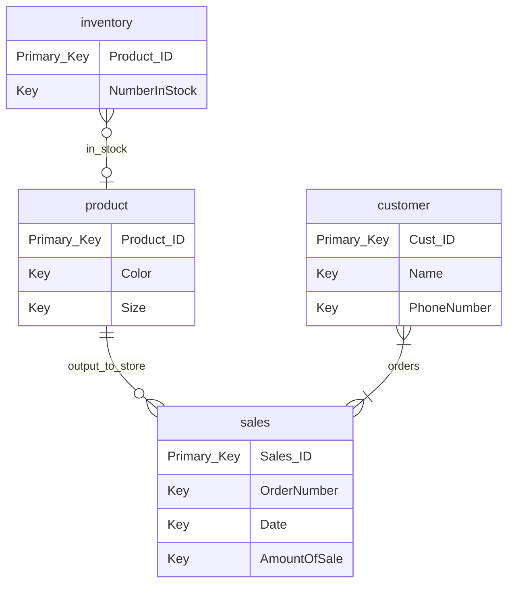

# Nike Store Entity Relationship Diagram 

### This digram shows the relationship between the Nike inventory and getting the product out to the customer.
### It is to help set up the new database that Nike is planning in it's upgrade to add new stores.
